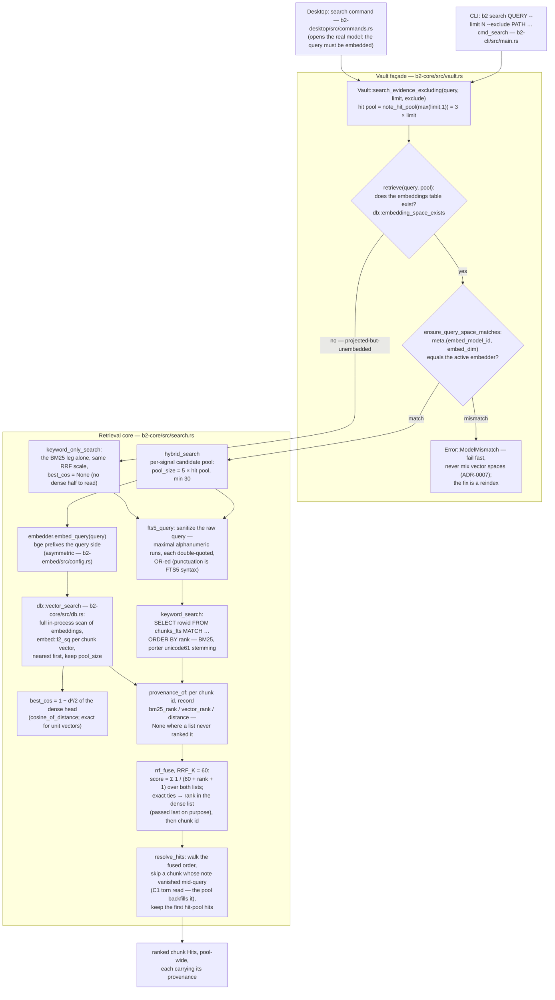
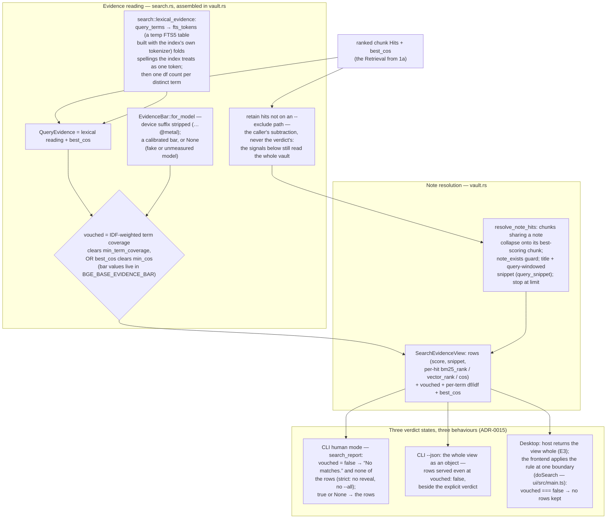

# B2 — Retrieval Flows: `search` & `similar`

> The guided walk through flows ② and ③ of [index-engine.md](index-engine.md) §4: how a query (or an
> anchor note) becomes a served result list, stage by stage, each stage anchored to the function
> that implements it. **The code is ground truth** — this doc is a projection of it, verified
> against the sources it links; the spec-level claims and their rationale stay in
> [index-engine.md](index-engine.md), [invariants.md](invariants.md) (D1/D2) and the ADRs they name
> (chiefly [ADR-0008](../../ADRs/0008-hybrid-retrieval-bm25-plus-vector-fused-by-rrf.md),
> [ADR-0009](../../ADRs/0009-discovery-is-model-free-at-surface-time.md),
> [ADR-0014](../../ADRs/0014-discovery-always-serves-the-ranked-prefix.md),
> [ADR-0015](../../ADRs/0015-a-served-search-result-is-a-claim-of-evidence.md)).
>
> Anchors link to files and name functions rather than line numbers, so they survive edits;
> `rg "fn <name>"` lands on each implementation. The evidence-bar *values* are deliberately not
> quoted anywhere in this doc — they live in `search::BGE_BASE_EVIDENCE_BAR`
> ([search.rs](../../crates/b2-core/src/search.rs)) and their justification is re-derived on every
> `make eval` run, never frozen into prose (ADR-0013; GH #187 is the lesson).
>
> Each flowchart is embedded as a committed SVG (`assets/`) so it renders on the GitHub Pages
> docs site as well as on GitHub, with its **Mermaid source collapsed beneath it as the editable
> ground truth** (GitHub renders the fence; Pages would not). After editing a source, regenerate
> the SVGs with [`scripts/render-flow-diagrams.sh`](../../scripts/render-flow-diagrams.sh).

## 1. Flow ② — search (`b2 search`, the desktop search pane)

Hybrid retrieval: BM25 over `chunks_fts` ⊕ brute-force vector KNN over `embeddings`, fused by
Reciprocal Rank Fusion, resolved from chunks up to notes, served **with** the evidence verdict that
lets a surface say "no matches" honestly. Both adapters call the same façade read,
[`Vault::search_evidence_excluding`](../../crates/b2-core/src/vault.rs) — the CLI via `cmd_search`,
the desktop via its `search` command — so the rows and the verdict are computed once, identically.

### 1a. From query to ranked notes

Mermaid source (edit this, then regenerate the SVG with <code>scripts/render-flow-diagrams.sh</code>)

### 1b. From ranked notes to what each surface shows

Mermaid source (edit this, then regenerate the SVG with <code>scripts/render-flow-diagrams.sh</code>)

### Anchors

| Stage | Function | Source |
|---|---|---|
| CLI entry, human rendering | `cmd_search`, `search_report` | [b2-cli/src/main.rs](../../crates/b2-cli/src/main.rs) |
| Desktop entry | `search` (Tauri command) | [b2-desktop/src/commands.rs](../../crates/b2-desktop/src/commands.rs) |
| Façade read, exclusion, verdict assembly | `Vault::search_evidence_excluding` | [b2-core/src/vault.rs](../../crates/b2-core/src/vault.rs) |
| Hybrid/BM25-only dispatch | `Vault::retrieve`, `db::embedding_space_exists` | [vault.rs](../../crates/b2-core/src/vault.rs), [db.rs](../../crates/b2-core/src/db.rs) |
| Model-identity fail-fast | `Vault::ensure_query_space_matches`, `db::recorded_embedder` | [vault.rs](../../crates/b2-core/src/vault.rs), [db.rs](../../crates/b2-core/src/db.rs) |
| Pool widths | `note_hit_pool`, `chunk_hit_pool`, `search::pool_size` | [vault.rs](../../crates/b2-core/src/vault.rs), [search.rs](../../crates/b2-core/src/search.rs) |
| Query sanitizing | `fts5_query`, `query_terms`, `quoted` | [search.rs](../../crates/b2-core/src/search.rs) |
| BM25 leg | `keyword_search` | [search.rs](../../crates/b2-core/src/search.rs) |
| Query embedding (bge query prefix) | `LocalEmbedder::embed_query`, `DEFAULT_QUERY_PREFIX` | [b2-embed/src/model.rs](../../crates/b2-embed/src/model.rs), [config.rs](../../crates/b2-embed/src/config.rs) |
| Dense leg (exact scan) | `db::vector_search` → `scan_vector_distances`, `embed::l2_sq` | [db.rs](../../crates/b2-core/src/db.rs), [embed.rs](../../crates/b2-core/src/embed.rs) |
| Absolute dense reading | `cosine_of_distance`, `Retrieval::best_cos` | [search.rs](../../crates/b2-core/src/search.rs) |
| Provenance, fusion, tie policy | `provenance_of`, `rrf_fuse`, `RRF_K` | [search.rs](../../crates/b2-core/src/search.rs) |
| Chunk→note resolution | `resolve_hits`, `db::note_for_chunk`; then `Vault::resolve_note_hits`, `query_snippet` | [search.rs](../../crates/b2-core/src/search.rs), [vault.rs](../../crates/b2-core/src/vault.rs) |
| Lexical evidence | `lexical_evidence`, `fts_tokens`, `LexicalEvidence::{idf, term_coverage, anchored}`, `db::index_tokenizer` | [search.rs](../../crates/b2-core/src/search.rs), [db.rs](../../crates/b2-core/src/db.rs) |
| The verdict | `EvidenceBar::for_model`, `BGE_BASE_EVIDENCE_BAR`, `QueryEvidence::vouched` | [search.rs](../../crates/b2-core/src/search.rs) |
| Frontend boundary | `doSearch` (`vouched === false` drops the rows once) | [ui/src/main.ts](../../ui/src/main.ts) |

### Widths at the default ask (`limit = 10`)

| View | Façade hit pool | Per-signal candidate pool |
|---|---|---|
| Note-level `Vault::search` / `search_evidence` | `3 × 10 = 30` (headroom for note-dedup + torn reads) | `pool_size(30) = 150` |
| Passage-level `Vault::search_chunks` (chat's retrieve step) | `10 + 2 = 12` (torn-read headroom only — no dedup) | `pool_size(12) = 60` |

The asymmetry is deliberate and priced (GH #141/#142): each unit of façade headroom buys five
candidates per signal, and RRF over a wider candidate set returns *different* answers, not more of
them — so width moves only on measured relevance ([index-engine.md](index-engine.md) §4–§5).

Two near-neighbours of this flow that are **not** `b2 search`:
[`vector_only_search`](../../crates/b2-core/src/search.rs) is the eval harness's ablation
instrument, never an adapter surface (GH #158); and
[`graph_filtered_search`](../../crates/b2-core/src/search.rs) is the vector⨝graph *scoped-traversal*
primitive ("nearest chunks within k typed hops"), whose complement is flow ③ below.

## 2. Flow ③ — similar (`b2 similar`, the desktop Similar pane)

Connection discovery: the notes semantically nearest the anchor that are **not already linked** to
it, ranked by exact best-passage distance, always served (D1/ADR-0014 — no statistic gates
membership). A **pure read over stored vectors**: no model call, no `embed_query` — the anchor is
represented by the chunk vectors a prior reindex stored, which is why the CLI opens the vault with
the fake embedder and still serves real-model rankings.

```mermaid
flowchart TD
    CLI["CLI: b2 similar NOTE --limit N<br>cmd_similar — b2-cli/src/main.rs<br>(opens with the fake embedder: a pure stored-vector read)"]
    GUI["Desktop Similar pane<br>similar command — b2-desktop/src/commands.rs"]

    CLI --> SIM
    GUI --> SIM

    subgraph FACADE["Vault façade — b2-core/src/vault.rs"]
        SIM["Vault::similar(note_ref, limit)"]
        GRADE["grade = recorded embed_model_id is not the fake's —<br>judged on the RECORDED space (db::recorded_embedder),<br>not the injected embedder, so a fake-opened read<br>of a real-embedded vault still grades"]
        RG{"anchor is an inventoried resource?<br>(resource::doc_kind + db::resource_detail)"}
        RERR["Error::ResourceUnsupported —<br>honest ‘not yet’, never an empty list<br>(resources gain discovery with chunks+centroids)"]
        REF["resolve_ref → anchor path;<br>Error::NoteNotFound for an unknown ref"]
    end

    SIM --> GRADE --> RG
    RG -->|yes| RERR
    RG -->|no| REF --> G0

    subgraph DISC["discover::candidates — b2-core/src/discover.rs"]
        G0{"limit is 0, or no embeddings table<br>(db::embedding_space_exists)?"}
        E0["serve nothing — there is<br>nothing to search from"]
        AV["load the anchor's stored chunk vectors<br>db::note_chunk_vectors — re-embeds nothing"]
        CEN{"centroid_of(anchor vectors) —<br>computed in-process (an anchor mid-embed<br>discovers from what it has); any vectors?"}
        EXCL["exclusion set = graph::reachable_within(anchor, 1):<br>the anchor + its direct neighbours, undirected<br>(EXCLUDE_HOPS = 1 keeps triadic-closure<br>candidates two hops out in the pool)"]
        S1["STAGE 1 — coarse, O(notes):<br>db::for_each_note_centroid streams every<br>(note, centroid); excluded notes skipped up front<br>so they never occupy a shortlist slot;<br>embed::l2_sq(anchor centroid, note centroid)"]
        SORT1["sort nearest-first, ties by path"]
        CUT["shortlist = max(limit × SHORTLIST_PER_RESULT,<br>SHORTLIST_MIN) = max(limit × 20, 200)<br>— a recall device, never a quality gate (GH #192)"]
        S2["STAGE 2 — exact, O(shortlist):<br>per shortlisted note, db::note_chunk_vectors;<br>best (smallest squared-L2) pair across<br>anchor chunks × candidate chunks;<br>strictly-less keeps the earliest chunk on ties;<br>a note with no stored vectors drops out"]
        SORT2["sort by best-pair distance, ties by path<br>— the served order (and, below, the z order:<br>one number, three names)"]
        ZQ{"grade, and scored population ≥<br>STATS_MIN_POPULATION (12), and sd > 0?"}
        ZY["z = (mean − d) / sd per candidate,<br>over the scored best-passage distances —<br>the strength band's input, gating nothing<br>(ADR-0014)"]
        ZN["no z — the list is served ungraded<br>and a surface must say so"]
        TAKE["take(limit) → CandidateNote:<br>score = −√(best-pair d²), the evidence<br>chunk id, z if graded"]
    end

    G0 -->|yes| E0
    G0 -->|no| AV --> CEN
    CEN -->|none| E0
    CEN -->|yes| EXCL --> S1 --> SORT1 --> CUT --> S2 --> SORT2 --> ZQ
    ZQ -->|yes| ZY --> TAKE
    ZQ -->|no| ZN --> TAKE

    subgraph OUT["Resolution & rendering"]
        VIEW["façade: + note title + evidence snippet<br>(db::chunk_text → snippet, head-bounded)<br>→ SimilarView { path, title, score, evidence, z }"]
        CLIOUT["CLI: score, name, path, evidence line,<br>plus the ‘commit one with b2 link …’ nudge;<br>empty list → two honest empty states,<br>neither claiming ‘nothing relates’ (GH #197)"]
        GUIOUT["Desktop card: strengthBand(z) dots —<br>ui/src/strength.ts; a null z paints no band<br>and the pane carries the ungraded caveat"]
    end

    TAKE --> VIEW
    VIEW --> CLIOUT
    VIEW --> GUIOUT
```

Mermaid source (edit this, then regenerate the SVG with <code>scripts/render-flow-diagrams.sh</code>)

### Anchors

| Stage | Function | Source |
|---|---|---|
| CLI entry, empty states, link nudge | `cmd_similar` | [b2-cli/src/main.rs](../../crates/b2-cli/src/main.rs) |
| Desktop entry | `similar` (Tauri command) | [b2-desktop/src/commands.rs](../../crates/b2-desktop/src/commands.rs) |
| Façade: grade decision, resource guard, ref resolution, view assembly | `Vault::similar`, `Vault::resolve_ref` | [b2-core/src/vault.rs](../../crates/b2-core/src/vault.rs) |
| Recorded-space identity | `db::recorded_embedder`, `embed::FAKE_MODEL_ID` | [db.rs](../../crates/b2-core/src/db.rs), [embed.rs](../../crates/b2-core/src/embed.rs) |
| Candidate generation (both stages, z, cap) | `discover::candidates` and its constants `EXCLUDE_HOPS`, `SHORTLIST_PER_RESULT`, `SHORTLIST_MIN`, `STATS_MIN_POPULATION` | [b2-core/src/discover.rs](../../crates/b2-core/src/discover.rs) |
| Anchor + candidate vectors | `db::note_chunk_vectors` | [db.rs](../../crates/b2-core/src/db.rs) |
| Anchor centroid | `embed::centroid_of` (spherical mean) | [embed.rs](../../crates/b2-core/src/embed.rs) |
| Exclusion set | `graph::reachable_within` over `graph::neighbors` | [graph.rs](../../crates/b2-core/src/graph.rs) |
| Stage-1 centroid stream | `db::for_each_note_centroid`, `embed::unpack_f32_into`, `embed::l2_sq` | [db.rs](../../crates/b2-core/src/db.rs), [embed.rs](../../crates/b2-core/src/embed.rs) |
| Evidence snippet | `db::chunk_text`, `snippet` | [db.rs](../../crates/b2-core/src/db.rs), [vault.rs](../../crates/b2-core/src/vault.rs) |
| Strength band | `strengthBand` | [ui/src/strength.ts](../../ui/src/strength.ts) |
| Committing (the human's half of flow ③) | `Vault::link`; the GUI drag gesture | [vault.rs](../../crates/b2-core/src/vault.rs), [ui/src/droplink.ts](../../ui/src/droplink.ts) |

### Shape at the default ask (`limit = 10`)

Stage 1 reads every `note_centroids` row once and keeps `max(10 × 20, 200) = 200` notes; stage 2
reads chunk vectors for those 200 notes only. On any vault at or below 200 candidate notes the
two-stage result is *exactly* the whole-space scan's (the shortlist covers everything), which is
what keeps the shape a pure performance device (GH #38, [index-engine.md](index-engine.md) §4).

## 3. The constants in one place

Structural constants (quoted here because they are design choices, not measurements):

| Constant | Value | Governs | Source |
|---|---|---|---|
| `RRF_K` | 60 | fusion weighting (qmd heritage) | [search.rs](../../crates/b2-core/src/search.rs) |
| `pool_size` | 5 × hit pool, min 30 | per-signal candidate depth | [search.rs](../../crates/b2-core/src/search.rs) |
| `note_hit_pool` | 3 × limit | note view headroom (dedup + torn reads) | [vault.rs](../../crates/b2-core/src/vault.rs) |
| `chunk_hit_pool` | limit + 2 | passage view headroom (torn reads only) | [vault.rs](../../crates/b2-core/src/vault.rs) |
| `SHORTLIST_PER_RESULT` | 20 | discovery stage-1 width per asked result | [discover.rs](../../crates/b2-core/src/discover.rs) |
| `SHORTLIST_MIN` | 200 | discovery stage-1 floor | [discover.rs](../../crates/b2-core/src/discover.rs) |
| `EXCLUDE_HOPS` | 1 | discovery's already-connected radius | [discover.rs](../../crates/b2-core/src/discover.rs) |
| `STATS_MIN_POPULATION` | 12 | smallest population a z is claimed over | [discover.rs](../../crates/b2-core/src/discover.rs) |
| `SNIPPET_CHARS` | 160 | one-line snippet bound (both flows) | [vault.rs](../../crates/b2-core/src/vault.rs) |

Distributional constants (named, never quoted — keyed to `embed_model_id`, re-justified by the eval
harness every run; a model swap invalidates them, ADR-0007/ADR-0013):

| Constant | Governs | Source |
|---|---|---|
| `BGE_BASE_EVIDENCE_BAR.min_term_coverage` | the lexical anchor (IDF-weighted coverage) | [search.rs](../../crates/b2-core/src/search.rs) |
| `BGE_BASE_EVIDENCE_BAR.min_cos` | the semantic backstop | [search.rs](../../crates/b2-core/src/search.rs) |
